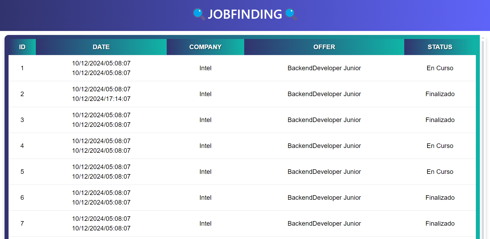
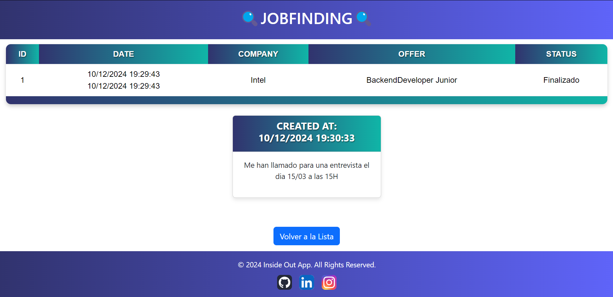
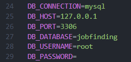
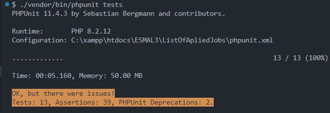
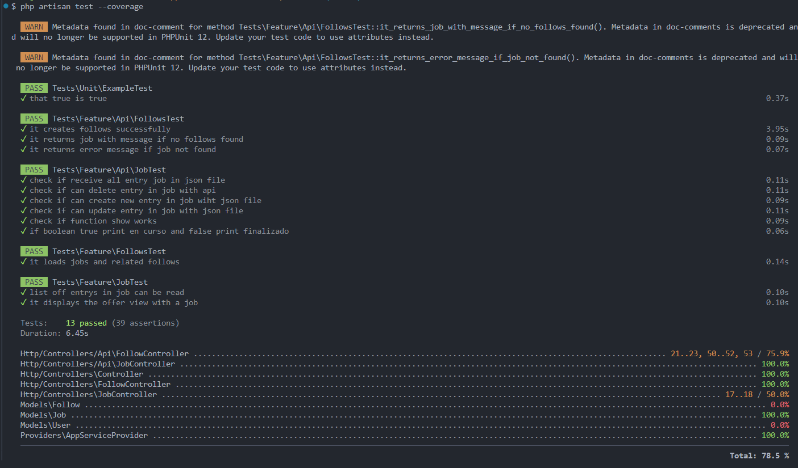
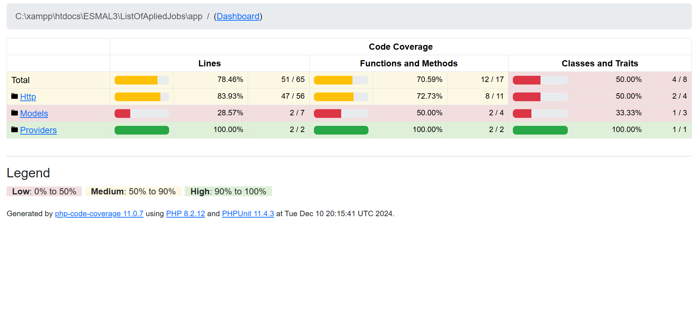
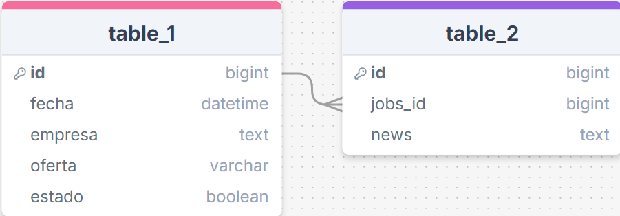

# 👨🏽‍💻 ListOfApliedJobs
This project is an API that collects data from a list about the offers that you aplied. The data of the offers aplied is displayed in the Home page with a table, and the news and follows of a certain offer aplied are displayed in the specific page of that offer with a table and cards.

## 🌄 Project views  

## 💻 Languages ​​and tools  

## ⚙️ Installation prerequisites
🟢Install [Node.js](https://nodejs.org/en/download/source-code)

🟢Install [Composer](https://getcomposer.org/download/)

## 🛠️ Installation Guide 
· Before starting to install the project, you will need to create a database (we have used mysql via xampp) and name it: `jobfinding`

· Open a terminal in the folder where you want the repository to be cloned and enter this command:

`git clone https://github.com/Kalixto73a/ListOfApliedJobs.git`

 As you clone the repository, it will appear all the elements on it; you need to rename the file ".env.example" to ".env" and fill it with theese values:

· In your preferred environment, open the project you cloned; you will need three consoles for the next step.

▷First Console:
    `npm install` `npm run dev`
    
▷Second Console:
    `composer install` `php artisan serve`
    
▷Third Console: 
    `php artisan migrat:fresh`
    `php artisan migrat:fresh --seed`
    
· In the second console that you have opened, press the ctrl key and click on the link to localhost that it offers you. It should take you to the main view of the project where the offers are located.

⚠️ If you have done the previous steps and the view has not opened correctly, go back to the third command console and enter this:

`php artisan key:generate` `php artisan config:cache` 

## 🌐 Endpoints 
This project has 6 endpoinst.

### ✏️ Create (POST)
`http://127.0.0.1:8000/api/jobs`

### ✏️ Create A New Follow of an Offer (POST)
`http://127.0.0.1:8000/api/jobs/{jobId}/follows`

### 📖 Read All Offers (GET)
`http://127.0.0.1:8000/api/jobs`

### ✏️✏️ Update (PUT)
`http://127.0.0.1:8000/api/jobs/{jobId}`
 
>Here you can only change the value of Status to:
> 
>0 = Finalizado
> 
>1 = En curso

### ❌ Destroy (DELETE)
`http://127.0.0.1:8000/api/jobs/{jobId}`

### 👁️ Show (GET)
`http://127.0.0.1:8000/api/jobs/{jobId}/follows`

## 💀 Tests 
All tests passed. Introduce this line on your console to check it:

`./vendor/bin/phpunit tests`

  

If you want to launch the tests and view them you can put these commands in console 3:

`php artisan test --coverage` `php artisan test --coverage-html=coverage-report`

  

  

## 🗂️ Diagram made (DDBB) 
I used [drawSQL](https://drawsql.app) to do the correct structure of the DDBB

  

## 👩‍💻 Authors
- [Alvaro Cervera Vigara](https://github.com/Kalixto73a)
